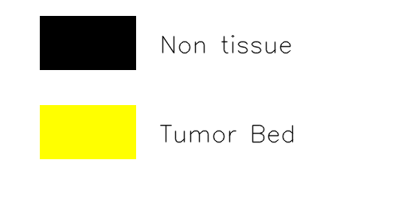

# command-line interface for Tube Model deployment in Polyscope 
This repository hosts the code intended for standalone deployment of tube model in any environmet  including polyscope (need's adjustment).

## Directory Structure
```
.
├── config/                  # Application and service configuration
│   ├── app_config.yaml
├── Dockerfile                # Container build configuration
├── docs/                    # Documentation and visual assets
│   └── tube_color_legend.png
├── models/                  # Model checkpoints and configs
│   └── <checkpoint_name>/
│       ├── model.pth
│       └── config.json
├── README.md
├── run_tube.sh     # script with example runs
├── tube_color_legend_to_png.py # Color legend generator
├── tube_models.py            # Tube model architectures
├── tube_processor.py         # Tube processing logic 
├── tube_utils.py             # utility functions
```


---

## AI Model Architecture

Current tube model works with one checkpoint (`m2f_mitb5_input-512_epochs-50_queries-8_epoch_50`). Training data for this model was TCGA lung samples (luad and lusc).

- **Model type:** `mask2former`
- **encoder backbone:** `nvidia/mit-b5`
- **decoder:** `custom`
- **Number of encoder blocks:** 4  
- **Image size:** 512 × 512  

See `config.json` for full details.

```
models/
└── m2f_mitb5_input-512_epochs-50_queries-8_epoch_50
    ├── model.pth    # Model object (**NEED TO BE PLACED HERE MANUALLY**)
    └── config.json   # Model parameters, labels, architecture
```

Find the `model.pth` file from below and place it in the above location on your side: 
```
/rsrch9/home/plm//idso_fa1_pathology/codes/sranjbar/polyscope_tube/polyscope-ai-tube/models/m2f_mitb5_input-512_epochs-50_queries-8_epoch_50/model.pth

```

The model supports the following classes:
```yaml
id2label:
  0: Non tissue
  1: Tumor
```


Segmentation colors are defined in `<checkpoint>/config.json` if you need to change them. 

### How to add new models

To add new checkpoints, you can create a folder for it inside models folder and place config.json and model.pth inside. Additionally, you will also need to implement relevant sections inside `utils/build_model_and_path()`.

### Supported Analysis
- Ss1 generation using appropriate sections of step 1 in the AI-sTIL pipeline  
- Patch-based segmentation of Ss1 image using tube model  

---

## Prerequisites
- `torch==2.6.0`  
- `transformers==4.36.2`
- `timm==0.9.8`
- `python==3.xx`  

See the full list in `Dockerfile`.  

---

### Interactive Usage
See the content of `run_tube.sh` for example usage. Here is how to run this file:

```bash
docker run --rm -it --user $(id -u):$(id -g) --shm-size=256g --cpuset-cpus=0-31 --gpus all -v /rsrch9/home/plm/idso_fa1_pathology:/rsrch9/home/plm/idso_fa1_pathology hpcharbor.mdanderson.edu/phacosta/tube:phacosta  /bin/bash
cd <code_dir>
. run_tube.sh
```

---

## Inputs and Outputs

###  Inputs 
The script requires two command-line arguments:

- `--input_file_path`:  
  Path to the input whole slide image file (e.g., `.svs` or `tif`).  

- `--output_dir`:  
  Path to the directory where results will be saved.

- `input_objective_power`: Objective power of image. Only needed for tif

### Outputs
At the end of the run, the `results_dir` will contain a folder named after the input file:

```
output_dir/
└── TMA5-001T.svs
    └── TMA5-001T.svs_Ss1_tbedPred.png   # predicted tumor bed image
    └── TMA5-001T.svs_Ss1.jpg.           # Ss1 image following AI-sTIL s methodology
    └── TMA5-001T.svs_stats.json         # json file with reportss
```

**Key Outputs**
- **`*_Ss1_tbedPred.png`**: predicted segmentation results bed image  
- **`*_stats.json`**: Final JSON report with runtimes and configurations  

#### Example Stats JSON
```json
{
    "metadata": {
        "file_name": "TMA5-001T.svs",
        "input_file_path": "/rsrch9/home/plm/idso_fa1_pathology/codes/sranjbar/polyscope_tube/anthrocosis_TMA5_examples/TMA5-001T.svs"
    },
    "config": {
        "tube_model_type": "mask2former",
        "tube_ckpt": "m2f_mitb5_input-512_epochs-50_queries-8_epoch_50",
        "model_config": {
            "backbone": "nvidia/mit-b5",
            "patch_gen_size": "512x3",
            "input_size": 512,
            "stride_factor": 3,
            "batch_size": 32,
            "epochs": 50,
            "tissue_threshold": 0.0,
            "tumor_bed_threshold": 0.5,
            "training_data": [
                "luad",
                "lusc"
            ],
            "decoder_params": {
                "embed_dim": 256,
                "num_queries": 8,
                "num_layers": 4,
                "nheads": 8,
                "in_channels": [
                    64,
                    128,
                    320,
                    512
                ]
            },
            "decoder": "Mask2FormerLite",
            "id2label": {
                "0": "Non tissue",
                "1": "Tumor Bed"
            },
            "label2id": {
                "Non tissue": 0,
                "Tumor Bed": 1
            },
            "id2color": {
                "0": "#000000",
                "1": "#ffff00"
            },
            "torch_dtype": "float32",
            "transformers_version": "4.36.2"
        }
    },
    "runtimes": {
        "ss1_generation_sec": 15.200522899627686,
        "tube_inference_sec": 10.137533187866211,
        "total_time_sec": 25.338056087493896
    }
}
```

---

## Application Configuration
The main app configuration is located in `config/app_config.yaml`:

```yaml
model_dir: models
tube_model_type: mask2former
tube_ckpt: m2f_mitb5_input-512_epochs-50_queries-8_epoch_50
```

---
